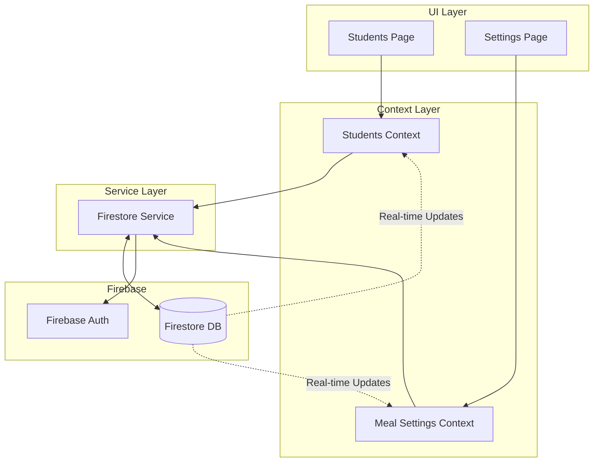
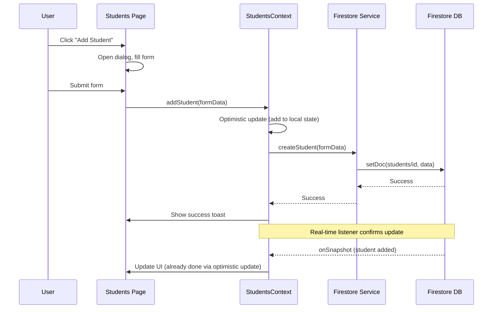
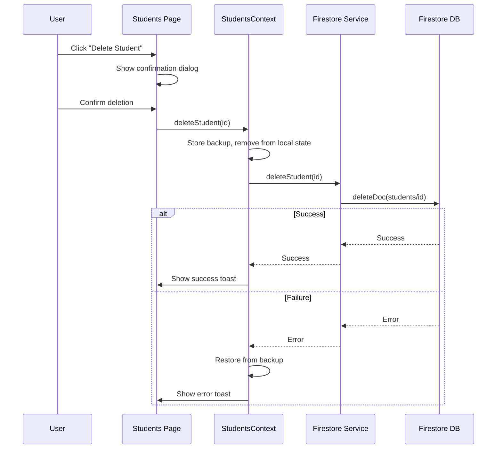

# Design Document: Firebase Student & Meal Settings Sync

## Overview

This design describes the implementation of real-time Firebase synchronization for student data and meal settings. The system replaces local mock data with Firestore as the source of truth, ensuring data persistence and real-time updates across all connected clients.

## Architecture



## Components and Interfaces

### 1. StudentsContext

A new React context that manages student state and Firebase synchronization.

```typescript
interface StudentsContextType {
  students: Student[];
  loading: boolean;
  error: string | null;
  addStudent: (data: StudentFormData) => Promise<void>;
  updateStudent: (id: string, data: Partial<StudentFormData>) => Promise<void>;
  deleteStudent: (id: string) => Promise<void>;
  searchStudents: (query: string) => Student[];
  refreshStudents: () => Promise<void>;
}
```

### 2. Firestore Service Functions (Existing)

The existing `src/lib/firestore.ts` already provides:
- `createStudent(data)` - Creates a new student document
- `updateStudent(id, updates)` - Updates an existing student
- `deleteStudent(id)` - Deletes a student document
- `getAllStudents()` - Fetches all students
- `subscribeToStudents(callback)` - Real-time subscription

### 3. Updated Students Page

The Students page will be refactored to:
- Use `StudentsContext` instead of local state
- Display loading states during data operations
- Handle errors gracefully with user feedback
- Support optimistic updates for better UX

### 4. Firestore Security Rules

Production-ready security rules requiring authentication:

```javascript
rules_version = '2';

service cloud.firestore {
  match /databases/{database}/documents {
    // Helper function to check authentication
    function isAuthenticated() {
      return request.auth != null;
    }
    
    // Students Collection
    match /students/{studentId} {
      allow read, write: if isAuthenticated();
    }
    
    // Cafeterias Collection
    match /cafeterias/{cafeteriaId} {
      allow read, write: if isAuthenticated();
    }
    
    // Settings Collection
    match /settings/{document=**} {
      allow read, write: if isAuthenticated();
    }
    
    // Meal Logs Collection
    match /mealLogs/{logId} {
      allow read, write: if isAuthenticated();
    }
  }
}
```

## Data Models

### Student Document (Firestore)

```typescript
interface StudentDocument {
  studentId: string;           // Document ID and barcode value
  fullName: string;
  fullNameAmharic?: string;
  department: string;
  year: number;
  photoURL?: string;
  cafeStatus: 'cafe' | 'none';
  hostelResident: boolean;
  monthlyQuota: number | null;
  usedQuota: number;
  allowedCafeterias?: string[];
  lastMeal?: {
    mealType: 'breakfast' | 'lunch' | 'dinner';
    timestamp: Timestamp;
    cafeteriaId: string;
  };
  notes?: string;
  createdAt: Timestamp;
  updatedAt: Timestamp;
}
```

### Meal Settings Document (Firestore)

```typescript
interface MealSettingsDocument {
  mealWindows: {
    breakfast: { start: string; end: string };
    lunch: { start: string; end: string };
    dinner: { start: string; end: string };
  };
  lockDurationMinutes: number;
  showEthiopianDate?: boolean;
  defaultLanguage?: 'en' | 'am';
  updatedAt: Timestamp;
}
```

## Sequence Diagrams

### Student Creation Flow



### Student Deletion Flow




## Correctness Properties

*A property is a characteristic or behavior that should hold true across all valid executions of a system—essentially, a formal statement about what the system should do. Properties serve as the bridge between human-readable specifications and machine-verifiable correctness guarantees.*

### Property 1: Student Data Round-Trip Consistency

*For any* valid student data, creating or updating a student via the Student_Manager and then fetching from Firestore SHALL return equivalent data (excluding server-generated timestamps).

**Validates: Requirements 1.1, 2.1**

### Property 2: Timestamp Invariant on Update

*For any* student update operation, the `updatedAt` timestamp after the operation SHALL be greater than or equal to the `updatedAt` timestamp before the operation.

**Validates: Requirements 2.2**

### Property 3: State Preservation on Failure

*For any* failed Firestore operation (create, update, or delete), the local student state SHALL be equivalent to the state before the operation was attempted.

**Validates: Requirements 1.4, 2.4, 3.3**

### Property 4: Delete Removes Document

*For any* student that exists in Firestore, after a successful delete operation, querying Firestore for that student's document SHALL return null/not found.

**Validates: Requirements 3.1**

### Property 5: Real-Time Sync Consistency

*For any* external modification to a student document in Firestore (add, modify, delete), the local state SHALL eventually reflect that change within the subscription callback.

**Validates: Requirements 4.2**

### Property 6: Settings Round-Trip Consistency

*For any* valid meal settings change (meal windows or lock duration), saving the settings and then fetching from Firestore SHALL return equivalent values.

**Validates: Requirements 5.1, 6.1, 6.2**

### Property 7: Authentication Required for All Operations

*For any* Firestore collection (students, settings, mealLogs, cafeterias), unauthenticated read or write requests SHALL be rejected.

**Validates: Requirements 7.1, 7.2, 7.3, 7.4**

## Error Handling

### Network Errors

1. **Connection Lost**: Display "Connection lost. Changes will sync when reconnected." toast
2. **Timeout**: Display "Operation timed out. Please try again." with retry button
3. **Permission Denied**: Display "You don't have permission to perform this action."

### Validation Errors

1. **Duplicate Student ID**: Display "A student with this ID already exists."
2. **Missing Required Fields**: Display "Please fill in all required fields."
3. **Invalid Time Format**: Display "Invalid time format. Use HH:MM format."

### Recovery Strategies

1. **Optimistic Update Rollback**: On failure, restore previous state from backup
2. **Retry Queue**: Failed operations can be retried manually via UI
3. **Offline Support**: Firestore's built-in offline persistence handles temporary disconnections

## Testing Strategy

### Unit Tests

Unit tests will cover:
- Form validation logic (required fields, duplicate IDs)
- Data transformation functions (Firestore timestamps to JS dates)
- Search/filter logic for students
- Time validation for meal windows

### Property-Based Tests

Property-based tests will use `fast-check` library for TypeScript:

1. **Student Round-Trip Test**: Generate random valid student data, create in Firestore, fetch back, verify equivalence
2. **Update Timestamp Test**: Generate random updates, verify timestamp increases
3. **Failure Rollback Test**: Mock Firestore failures, verify state restoration
4. **Settings Round-Trip Test**: Generate random valid settings, save, fetch, verify equivalence

Configuration:
- Minimum 100 iterations per property test
- Each test tagged with: **Feature: firebase-student-meal-sync, Property {N}: {description}**

### Integration Tests

Integration tests will cover:
- Full CRUD flow for students with real Firestore emulator
- Real-time subscription updates
- Authentication requirement enforcement
- Concurrent modification handling

### Test Environment

- Use Firebase Emulator Suite for local testing
- Mock authentication for unit tests
- Use Firestore emulator for integration tests
